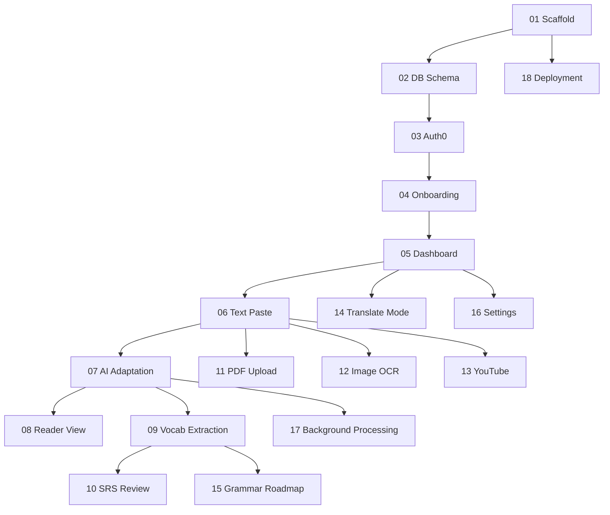

# Learn Lang — Feature Specs

Build order is designed so each spec builds on the previous ones. Start from the top and work down.

## Foundation Layer
| # | Spec | Description |
|---|------|-------------|
| 01 | [Project Scaffold](./01-project-scaffold.md) | Mono-repo, Next.js, FastAPI, PostgreSQL, Docker Compose |
| 02 | [Database Schema & User Model](./02-database-schema-user-model.md) | Users table, allowlist, Alembic migrations |
| 03 | [Authentication (Auth0)](./03-authentication-auth0.md) | Login/logout, JWT validation, allowlist enforcement |
| 04 | [Onboarding & Language Selection](./04-onboarding-language-selection.md) | First-login language picker flow |
| 05 | [Dashboard Shell & Navigation](./05-dashboard-shell-navigation.md) | App layout, sidebar, placeholder widgets |

## Core Reading Experience
| # | Spec | Description |
|---|------|-------------|
| 06 | [Content Ingestion: Text Paste](./06-content-ingestion-text-paste.md) | Paste text → store → display in Learning Stack |
| 07 | [AI Text Adaptation](./07-ai-text-adaptation.md) | Ilya Frank method via OpenRouter AI |
| 08 | [Reader View](./08-reader-view.md) | Reading UI with TTS pronunciation |

## Vocabulary & SRS
| # | Spec | Description |
|---|------|-------------|
| 09 | [Vocabulary Extraction](./09-vocabulary-extraction.md) | Extract words from text, build word_progress table |
| 10 | [SRS Flashcard Review](./10-srs-flashcard-review.md) | SM-2 algorithm, card UI, session summary |

## Additional Ingestion Methods
| # | Spec | Description |
|---|------|-------------|
| 11 | [Content Ingestion: PDF](./11-content-ingestion-pdf.md) | PDF upload + text extraction via pdfplumber |
| 12 | [Content Ingestion: Image (OCR)](./12-content-ingestion-image-ocr.md) | Image upload + EasyOCR with user review |
| 13 | [Content Ingestion: YouTube](./13-content-ingestion-youtube.md) | YouTube URL → transcript extraction |

## Extended Features
| # | Spec | Description |
|---|------|-------------|
| 14 | [Suggest Translation Mode](./14-suggest-translation-mode.md) | Multi-variation AI translations with SRS push |
| 15 | [Grammar Roadmap](./15-grammar-roadmap.md) | Passive grammar tracking + mastery tests |
| 16 | [Settings & Preferences](./16-settings-preferences.md) | Profile, theme, SRS limits, data export |

## Infrastructure
| # | Spec | Description |
|---|------|-------------|
| 17 | [Background Processing](./17-background-processing.md) | Async pipeline with step tracking + retry |
| 18 | [Deployment (Docker + Dokploy)](./18-deployment-docker-dokploy.md) | Production Docker config, Dokploy integration |

## Dependency Graph

